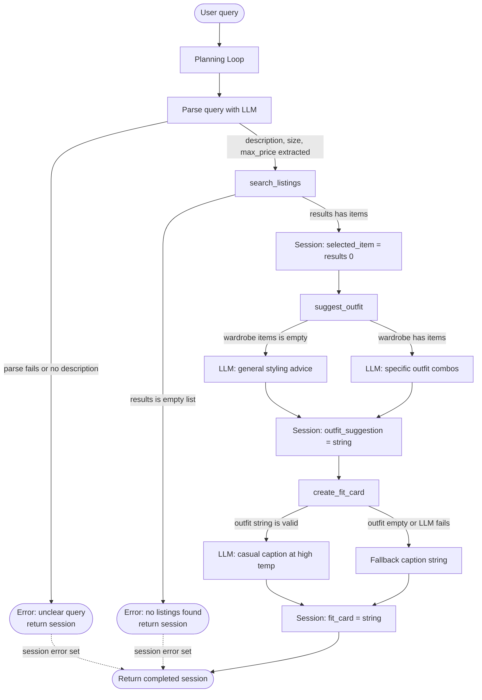

# FitFindr — planning.md

> Complete this document before writing any implementation code.
> Your spec and agent diagram are what you'll use to direct AI tools (Claude, Copilot, etc.) to generate your implementation — the more specific they are, the more useful the generated code will be.
> Your planning.md will be reviewed as part of your submission.
> Update it before starting any stretch features.

---

## Tools

### Tool 1: search_listings

**What it does:**
This tool searches the mock listings dataset for secondhand items that match what the user described. It filters by price and size if those were provided, scores every remaining listing by how many of the user's keywords appear in its title, description, and style_tags, and returns the results sorted from most to least relevant.

**Input parameters:**
- `description` (str): Keywords describing what the user wants, like "vintage graphic tee". This string gets split into individual words and matched against each listing's title, description, and style_tags fields.
- `size` (str | None): A size string like "M", "S/M", or "W30". Matching is case-insensitive. Pass None to skip size filtering entirely.
- `max_price` (float | None): The highest price the user is willing to pay, in dollars, inclusive. Pass None to skip price filtering.

**What it returns:**
A list of listing dicts sorted by relevance score, highest first. Each dict has these fields: `id` (str), `title` (str), `description` (str), `category` (str), `style_tags` (list of strings), `size` (str), `condition` (str), `price` (float), `colors` (list of strings), `brand` (str or None), and `platform` (str). If nothing matches, it returns an empty list and never raises an exception.

**What happens if it fails or returns nothing:**
The agent sets `session["error"]` to a message like "No listings found for 'vintage graphic tee' under $30. Try broadening your search by removing the size filter, raising your price limit, or using different keywords." Then it returns the session right away without calling suggest_outfit or create_fit_card.

---

### Tool 2: suggest_outfit

**What it does:**
This tool takes the thrifted item the user is considering and their existing wardrobe, then asks the LLM to suggest one or two complete outfit combinations that incorporate the new piece alongside things the user already owns. If the wardrobe is empty, it gives general styling advice for the item instead.

**Input parameters:**
- `new_item` (dict): A listing dict from search_listings representing the item the user is thinking about buying. At minimum it needs `title`, `style_tags`, `colors`, and `category` to build a useful prompt.
- `wardrobe` (dict): A wardrobe dict with an `items` key containing a list of wardrobe item dicts. Each wardrobe item has `id`, `name`, `category`, `colors`, `style_tags`, and `notes`. The list may be empty.

**What it returns:**
A non-empty string describing one or two outfits. When the wardrobe has items, the suggestion names specific pieces by name and describes the overall vibe, sometimes with a styling tip. When the wardrobe is empty, it describes what kinds of pieces would pair well with the item and what aesthetic it suits.

**What happens if it fails or returns nothing:**
If the LLM call raises an exception or returns an empty string, the tool returns a hardcoded fallback: "Couldn't generate an outfit suggestion right now. This item would pair well with classic basics like straight-leg jeans and clean sneakers as a starting point." The agent stores this and continues to create_fit_card rather than stopping.

---

### Tool 3: create_fit_card

**What it does:**
This tool generates a short, casual caption for the outfit, the kind of thing someone would actually post as an Instagram or TikTok OOTD. It uses a higher LLM temperature so the output feels fresh and different across different inputs rather than templated.

**Input parameters:**
- `outfit` (str): The outfit suggestion string returned by suggest_outfit. The LLM uses this to understand how the item is being styled and capture the right vibe in the caption.
- `new_item` (dict): The listing dict for the thrifted item. The tool pulls `title`, `price`, and `platform` from this to mention them naturally in the caption.

**What it returns:**
A 2 to 4 sentence string written in a casual first-person voice. The item name, price, and platform each appear once. The caption captures the specific vibe of the outfit rather than describing it like a product listing.

**What happens if it fails or returns nothing:**
If `outfit` is empty or only whitespace, the tool returns "Couldn't generate a fit card because the outfit description was missing. Try running the search again." If the LLM call itself fails, it returns a short fallback that still includes the item title, platform, and price so the user gets something useful. The tool never raises an exception.

---

### Additional Tools (if any)

### Tool 4: price_comparison

**What it does:**
This tool takes the selected item and estimates whether its price is fair by finding listings in the same category with overlapping style_tags and comparing their prices against the selected item's price.

**Input parameters:**
- `item` (dict): A listing dict for the item the user is considering. The tool uses `category`, `style_tags`, and `price` to find comparable listings.

**What it returns:**
A short string estimating whether the price is fair, like "This $24 tee is priced below the average of $31 for similar vintage graphic tops in the dataset." Returns a message like "Not enough comparable listings to estimate fairness." if fewer than two comparable items are found.

**What happens if it fails or returns nothing:**
If no comparable listings exist, the tool returns the not-enough-data message rather than raising an exception. The agent treats this as a soft result and includes it in the session without stopping the flow.

---

### Tool 5: retry logic with fallback

**What it does:**
If search_listings returns an empty list on the first attempt, the planning loop automatically retries with size set to None and informs the user that the size filter was removed to broaden the search. This lives in the planning loop rather than a separate function.

**Input parameters:**
- Same as search_listings: `description` (str), `size` (str | None), `max_price` (float | None). On retry, size is forced to None.

**What it returns:**
Same return value as search_listings: a list of listing dicts sorted by relevance, or an empty list if still nothing matches after the relaxed retry.

**What happens if it fails or returns nothing:**
If the retry also returns empty, the agent sets `session["error"]` to "No listings found even after removing the size filter. Try different keywords or raising your price limit." and returns the session early as normal.

---

## Planning Loop

**How does your agent decide which tool to call next?**
The loop runs as a single linear pass through the session with two possible early-exit points. Here is the exact logic step by step.

First, the session is initialized with `_new_session(query, wardrobe)`. Then the agent sends the user's query to the LLM and asks it to extract three things: a description string, a size string (or None), and a max price as a float (or None). These get stored in `session["parsed"]`. If parsing fails or comes back with no description at all, the agent sets `session["error"]` to a message asking the user to rephrase and returns the session immediately.

Next, the agent calls `search_listings` with the parsed description, size, and max_price and stores the results in `session["search_results"]`. If the list is empty, it sets `session["error"]` to the no-results message described in Tool 1 and returns right there. It does not proceed to suggest_outfit with empty input.

If results came back, the agent sets `session["selected_item"]` to `session["search_results"][0]`, the top-ranked result. It then calls `suggest_outfit` with that item and the wardrobe, storing the returned string in `session["outfit_suggestion"]`. This tool always returns a non-empty string, so the loop always continues after this step.

Finally, the agent calls `create_fit_card` with the outfit suggestion string and the selected item, and stores the result in `session["fit_card"]`. This tool also always returns something. The agent returns the completed session with `session["error"]` set to None.

---

## State Management

**How does information from one tool get passed to the next?**
All state lives in a single session dict that `_new_session()` creates at the start of each run. The keys are fixed: `query` holds the original input and never changes, `parsed` holds the extracted description, size, and max_price after step 2, `search_results` holds the full list of matching listings, `selected_item` holds the single listing dict passed into the remaining tools, `wardrobe` holds the wardrobe dict passed in at the start, `outfit_suggestion` holds the string from suggest_outfit, `fit_card` holds the string from create_fit_card, and `error` holds a message string if anything went wrong or None if everything succeeded.

The tools themselves are stateless functions. They receive inputs, return outputs, and do not touch the session. The planning loop is the only thing that reads from and writes to the session dict, which makes it easy to trace exactly what happened during any given run.

---

## Error Handling

| Tool | Failure mode | Agent response |
|------|-------------|----------------|
| `search_listings` | No results match the query | Sets `session["error"]` to "No listings found for '[description]' [with size/price context if provided]. Try broadening your search by removing the size filter, raising your price limit, or using different keywords." Returns the session immediately and never calls the remaining tools. |
| `suggest_outfit` | Wardrobe is empty | Calls the LLM with a general styling prompt that omits the wardrobe items list and returns whatever it generates instead of specific pairings. |
| `create_fit_card` | Outfit input is missing or incomplete | Returns "Couldn't generate a fit card because the outfit description was missing. Try running the search again." and never raises an exception. |

---

## Architecture

---

## AI Tool Plan

**Milestone 3 — Individual tool implementations:**

For `search_listings`, I'll give Claude the Tool 1 block from planning.md (what it does, input parameters, return value, and failure mode) and ask it to implement the function using `load_listings()` from the data loader. Before running it I'll check that the generated code filters by all three parameters independently, scores by keyword overlap across title, description, and style_tags, drops zero-score listings, and returns an empty list rather than raising when nothing matches. Then I'll test it with three queries: "vintage graphic tee" with no filters (should return results), "designer ballgown" with size XXS and max $5 (should return empty), and "jacket" with max_price $10 (every result's price should be at or under $10).

For `suggest_outfit`, I'll give Claude the Tool 2 block from planning.md and the `_get_groq_client()` helper already in tools.py and ask it to implement the function. Before running it I'll check that the code checks whether `wardrobe["items"]` is empty before building the prompt and uses a different prompt for each case. I'll test it with `get_example_wardrobe()` and confirm the output names specific wardrobe pieces, then test it with `get_empty_wardrobe()` and confirm it gives general advice without crashing.

For `create_fit_card`, I'll give Claude the Tool 3 block from planning.md and ask it to implement the function with a temperature of 0.9 or higher. Before running it I'll check that the code guards against an empty outfit string before calling the LLM. I'll run it twice on the same input and confirm the outputs differ, and if they don't I'll ask Claude to raise the temperature until they do.

**Milestone 4 — Planning loop and state management:**

I'll give Claude the Planning Loop section, the State Management section, and the Mermaid architecture diagram from planning.md and ask it to implement `run_agent()` in agent.py and `handle_query()` in app.py. Before running either I'll check that `run_agent()` calls `_new_session()` first, exits immediately after an empty search result without calling the remaining tools, passes `selected_item` and `wardrobe` from the session dict into suggest_outfit rather than re-prompting, and never calls suggest_outfit or create_fit_card when `session["error"]` is already set. I'll verify state is flowing correctly by printing `session["selected_item"]` and confirming it's the same dict that went into suggest_outfit, then running the no-results test case already in agent.py and confirming `session["fit_card"]` is None.

---

## A Complete Interaction (Step by Step)

FitFindr is an AI thrift-shopping assistant that uses three tools in sequence to help users find secondhand clothing and style it. A search tool finds matching listings from the mock dataset; an outfit suggestion tool uses the top result and the user's existing wardrobe to suggest complete looks; and a fit card tool generates a shareable social-media-style caption that the user could use. If the search returns nothing, the agent stops immediately and tells the user what to try differently instead of passing empty data to the next tool.

**Example user query:** "I'm looking for a vintage graphic tee under $30. I mostly wear baggy jeans and chunky sneakers. What's out there and how would I style it?"

**Step 1:**
The agent parses the query to extract keywords ("vintage graphic tee"), no explicit size, and a max price of $30. It calls `search_listings(description="vintage graphic tee", size=None, max_price=30.0)`. The tool filters listings.json, keeping only items priced at or under $30, then scores each by how many keywords from the description appear in the title, description, and style_tags. It returns a ranked list. The top result is lst_006: "Graphic Tee, 2003 Tour Bootleg Style", $24, size L, on Depop, with style_tags ["graphic tee", "vintage", "grunge", "streetwear", "band tee"]. The agent stores this in `session["search_results"]` and sets `session["selected_item"]` to lst_006.

**Step 2:**
With the selected item, the agent calls `suggest_outfit(new_item=lst_006, wardrobe=get_example_wardrobe())`. The wardrobe has 10 items including baggy dark-wash jeans (w_001), chunky white sneakers (w_007), black combat boots (w_008), and a vintage black denim jacket (w_006). The LLM receives both the item details and the wardrobe list and returns something like: "Pair this boxy graphic tee with your baggy dark-wash jeans and chunky white sneakers for a classic 90s streetwear look, and tuck the front corner slightly to add shape. For a grungier take, swap the sneakers for your black combat boots and throw the vintage denim jacket on top." The agent stores this in `session["outfit_suggestion"]`.

**Step 3:**
The agent calls `create_fit_card(outfit=session["outfit_suggestion"], new_item=lst_006)`. The LLM receives the outfit description and the item's title, price, and platform, and generates a short casual caption. It returns something like: "found this faded bootleg tee on depop for $24 and it was made for my baggy jeans era 🖤 styled it two ways: chunky sneakers for day, combat boots and a denim jacket when the sun goes down. thrift, don't buy new." The agent stores this in `session["fit_card"]`.

**Final output to user:**
The Gradio UI displays three panels: (1) the top listing: title, price, condition, size, platform; (2) the outfit suggestion with specific wardrobe pairings; (3) the fit card caption ready to copy and post.